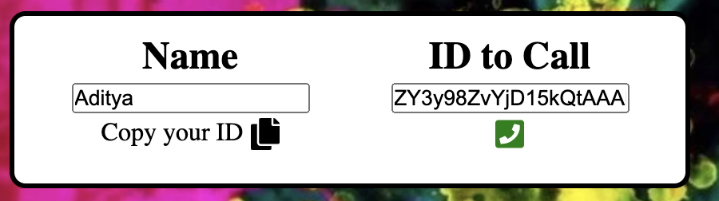

# Hack Technology / Project Attempted
The technology I wanted to learn was WebRTC, and specifically how to use APIs that wrap the WebRTC API to make usage easier. The specific React library I focused on was [`Simple Peer`](https://github.com/feross/simple-peer).

## What you built? 

I decided to build a small video chatting app that used `Simple Peer` to establish connections between two users of the app and enable video and voice communication in a simple chatting interface. In addition to video chatting functionality, the app also notifies a user when they are being called and allows a user to pick up, hang up, and end a call. 

The pictures below demonstrate me calling myself because this app is not deployed anywhere so I am the person with a laptop that can connect to my own localhost. However, if the app were deployed as well as the backend socket connection funcionality, anyone would be able to call anyone else. 

This shows the base app before you call anyone.

This shows how you can copy your own ID and paste it into the ID to Call section. The ID to Call section is where you can paste anyone's ID and make a call to them.

This image shows how you get a notification when someone calls you. You can either answer or decline the call.

This image shows what the app looks like during a call. You can see both streams, and have the option to hang up the call below the ID to Call section. 

## Who Did What?

I worked on this hack by myself. 

## What you learned

The first thing I learned was how to create a "backend" server for creating connections between two users of this app. I had to learn how to use the `socket.io` library and how to emit and listen for different events such as "callUser" based on the action performed by the user. 

I also learned how to use the `Simple Peer` library as well as React Context via `useContext`. 

In terms of React Context, it was clear that it is a tool used to pass information and functions down to deeper nested components without having to send everything as props. In `SocketContext.js`, we pass in all of the necessary functions and variables into the context. Then, we do not need to call props to access functions, but instead we can just import the context and extract all of the functions and variables we passed in. This made me wonder if there is any point passing in props to nested functions when we can just stick everything into the React Context. 

I also learned how to use `Simple Peer`, and the name is pretty accurate as it was a very simple connection API. I learned that using this library we can initialize a `Peer` that can handle the creation of a connection to another peer on the same server and passing stream data to the app as it is an instance of `Event Emitter`. The peer can pass and listen for information to and from other peers by using a Websocket server. It makes it very easy to simply pass stream data from one peer to another, and we can display this data via the `<video>` tag in the React app. 

The process for creating the App was not as simple as just following the tutorial for me and I came across a couple of issues. For one, I was having trouble displaying the two video streams for the current user and the person they were calling. This is because I had never used React's `useRef()` function (which creates a mutable object), and it was required to store the video stream. I was initially passing the stream into the `video` and `userVideo` refs incorrectly. For some reason, I would keep getting an error that I couldn't modify the `srcObject` property of `video.current` because it was undefined. I'm not sure why this fixed the issue, but I was only able to get it to work once I passed the two video refs into the SocketContext provider and pass them into their corresponding `<video>` tags. I still am not sure why the videoRef being referenced was the solution, as I thought that I would just be able to modify a mutable object as soon as I instantiated it. 

I also had an issue I was unable to resolve regarding using components from Material-UI. For some reason, I got an error that there was a mismatch between the React versions whenever I would include any component from Material-UI. The tutorial made use of these components for premade styling, so I ended up having to style the whole app manually. However, this was not my biggest concern since I was mainly focused on the video communication technology provided by `Simple Peer`. 

One thing I tried to do but was unable to do was set up a chatting functionality between people in the call due to the limitations of `Simple Peer`. This library only supports video and audio communication, and does not implement WebRTC's chat functionality. I guess this is why it was called `Simple Peer`, but if I want to expand this project I would have to move away from this library and either implement using WebRTC directly or use a library that has more advanced functionality like `Peer.js`.  

## Authors

Aditya Choudhari

## Acknowledgments

In order to create this app, I followed this tutorial: [link](https://www.youtube.com/watch?v=oxFr7we3LC8&ab_channel=JavaScriptMastery).
